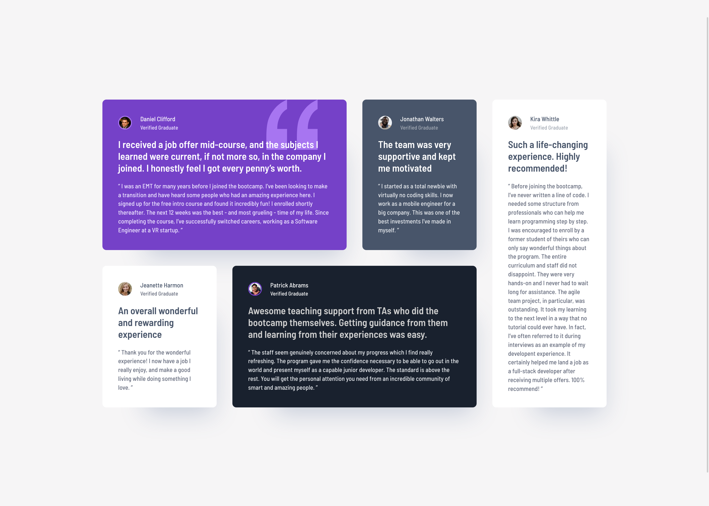
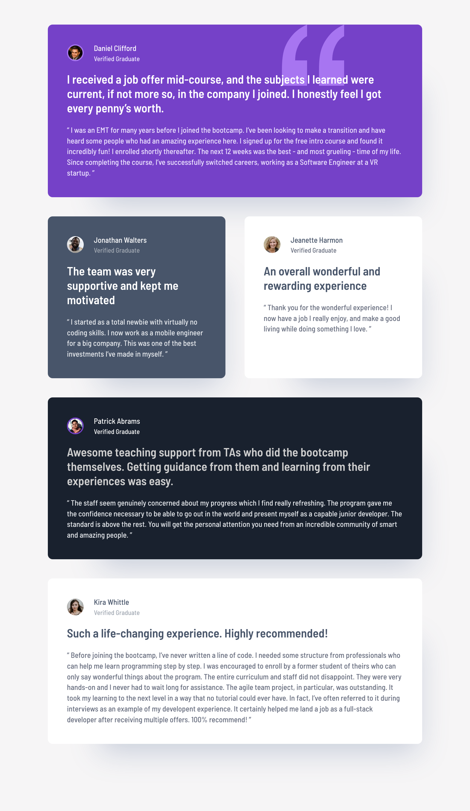

# Frontend Mentor - Testimonials grid section solution

This is a solution to the [Testimonials grid section challenge on Frontend Mentor](https://www.frontendmentor.io/challenges/testimonials-grid-section-Nnw6J7Un7).

### Design screenshots

#### Desktop 🖥️

#### Tablet 💻

#### Mobile 📱

### Links

- Solution URL: [GitHub](https://github.com/JuliAlchemDev/FM-testimonials-grid-section)
- Live Site URL: [GitHub Pages]()

## My process
1. Project setup
    - Initialized the project with a React starter kit.
    - Created the initial project structure and committed the first files.
2. Data and assets preparation
    - Organized testimonial images and created testimonials-data.json to store content.
    - Ensured semantic HTML structure using BEM methodology.
3. Component development
    - Rendered testimonials dynamically in React functional components.
    - Integrated images and applied semantic markup for accessibility.
4. Responsive design and styling
    - Set up responsive layout using CSS Grid.
    - Applied mobile-first workflow and media queries to match Figma designs.
5. Refactoring and utility classes
    - Extracted repeated styles into utility classes in styles.css.
    - Loaded dynamic card styles from card-styles.json to reduce duplication and enable style variants.

### What I learned
- Dynamically applying styles from **JSON** in React components.
- Efficiently using **utility classes** to reduce CSS duplication.
- Managing state and **data fetching** in React functional components.
- Structuring a project for **scalable** and **maintainable** code.

### Built with

- **React** (Functional Components, Hooks: `useState`, `useEffect`)
- **Semantic HTML5**
- **CSS Grid** 
- **CSS custom properties**
- **Mobile-first workflow**
- **BEM methodology**
- **Accessible markup** (`aria`, `focus-visible`, alt text)
- **Responsive design** using `rem` units and media queries
- **Figma** as the main design reference

## Author

- Linkedin - [Julia Alkhimova](https://www.linkedin.com/in/julialkhimova/)
- Frontend Mentor - [@JuliAlchemDev](https://www.frontendmentor.io/profile/JuliAlchemDev)
